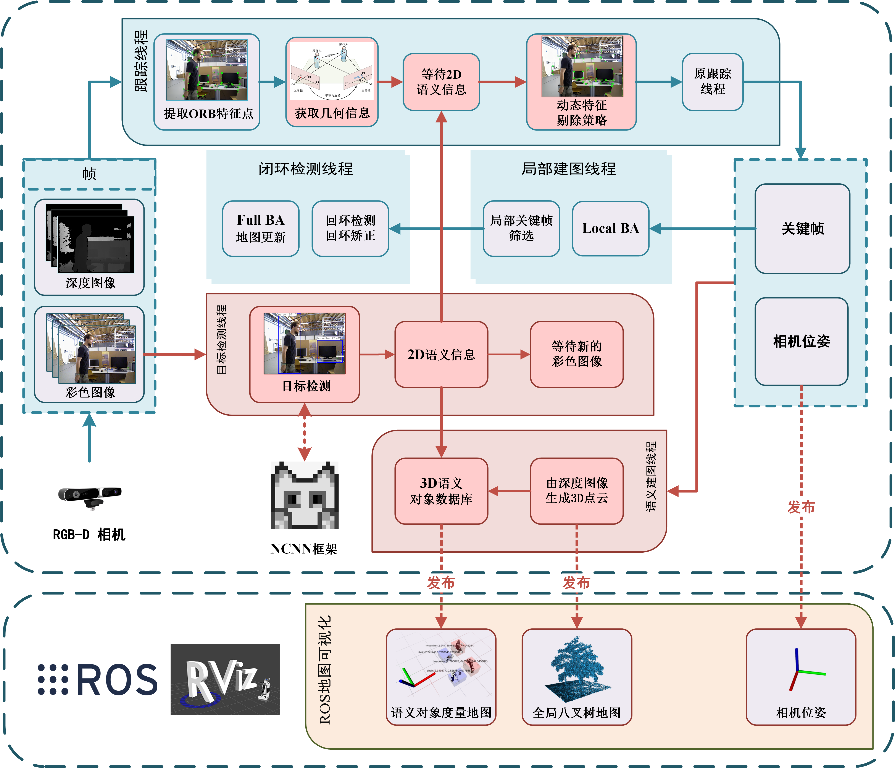
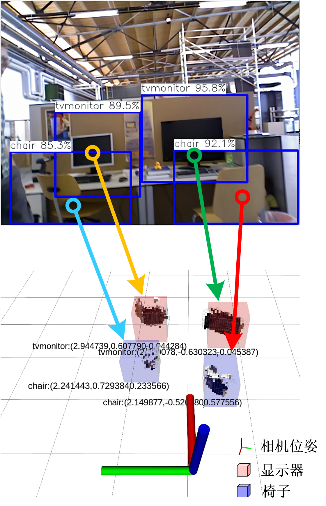

# SG-SLAM

SLAM是智能移动机器人在未知环境中进行状态估计的基本能力之一。然而，大多数视觉SLAM系统**依赖于静态场景的假设**，因此在动态场景中的准确性和鲁棒性严重下降。此外，许多系统构建的度量图**缺乏语义信息**，因此机器人无法在人类的认知水平上理解他们的周围环境。

SG-SLAM是一个基于[ORB-SLAM2](https://github.com/raulmur/ORB_SLAM2)框架的实时RGB-D语义视觉SLAM系统。首先，SG-SLAM增加了两个新的并行线程：一个获取2D语义信息的对象检测线程和一个语义建图线程。然后，在跟踪线程中加入了一个融合语义和几何信息的**快速动态特征剔除算法**。最后，在语义建图线程中生成3D点云和3D语义对象后，它们被发布到ROS系统中进行可视化。

在TUM数据集、波恩数据集和OpenLORIS-Scene数据集进行了实验评估，结果表明SG-SLAM不仅是动态场景中非常实时、准确、鲁棒的系统之一，而且还可以创建直观的语义对象度量地图。



**图1**. SG-SLAM系统框架。ORB-SLAM2的原始框架以水绿色背景呈现，新（或修改的）功能以红色背景呈现。



**图2**.   tum rgbd dataset fr3/walking_xyz 序列的语义对象度量地图


**图3**.  tum rgbd dataset fr3/long office household 序列的八叉树地图


**图**4.  实际运行效果图


**系统特点 :**

- 基于ORB-SLAM2, NCNN,  ROS, etc.
- 实时  (如果NCNN配置好GPU CUDA加速的话)
- 较其他同类工作（可能更）容易配置和部署
- ...

## 1. License

SG-SLAM 基于协议 [GPLv3 license](https://github.com/silencht/SG-SLAM/blob/main/LICENSE).

论文可在此处下载（或本仓库doc） [IEEE Xplore](https://ieeexplore.ieee.org/abstract/document/9978699/).

如果是学术使用, 请引用（BibTex）:

```
@ARTICLE{9978699,
  author={Cheng, Shuhong and Sun, Changhe and Zhang, Shijun and Zhang, Dianfan},
  journal={IEEE Transactions on Instrumentation and Measurement}, 
  title={SG-SLAM: A Real-Time RGB-D Visual SLAM Toward Dynamic Scenes With Semantic and Geometric Information}, 
  year={2023},
  volume={72},
  number={},
  pages={1-12},
  doi={10.1109/TIM.2022.3228006}}
```

## 2. 编译配置 SG-SLAM

```bash
#最基本的
sudo apt-get update
sudo apt install git
sudo apt install cmake
sudo apt install build-essential
sudo apt vim
#test
git --version
gcc --version
g++ --version
cmake --version

#Pangolin
sudo apt install libglew-dev
sudo apt install libboost-dev libboost-thread-dev libboost-filesystem-dev
sudo apt install libpython2.7-dev
git clone https://github.com/stevenlovegrove/Pangolin.git
cd Pangolin/
git checkout v0.5
mkdir build
cd build
cmake ..
make -j4
sudo make install

#OpenCV,可参考https://docs.opencv.org/3.4.15/d7/d9f/tutorial_linux_install.html
sudo apt install libgtk2.0-dev pkg-config libavcodec-dev libavformat-dev libswscale-dev
sudo apt install python-dev python-numpy libtbb2 libtbb-dev libjpeg-dev libpng-dev libtiff-dev libjasper-dev libdc1394-22-dev
git clone https://github.com/opencv/opencv.git
cd opencv/
git checkout 3.4.15
mkdir build
cd build
cmake -D CMAKE_BUILD_TYPE=Release -D CMAKE_INSTALL_PREFIX=/usr/local ..
sudo make install
#test
pkg-config opencv --modversion

#Eigen
git clone https://gitlab.com/libeigen/eigen.git
cd eigen/
git checkout 3.1.0
mkdir build
cd build
cmake ..
sudo make install
#test
cat /usr/local/include/eigen3/Eigen/src/Core/util/Macros.h
#Compile orb-slam2 with build.sh,and now orbslam2 can perform well

#ROS
#中国大陆可换源,resource(http://wiki.ros.org/ROS/Installation/UbuntuMirrors)
sudo sh -c '. /etc/lsb-release && echo "deb http://mirrors.tuna.tsinghua.edu.cn/ros/ubuntu/ `lsb_release -cs` main" > /etc/apt/sources.list.d/ros-latest.list'
#Set up keys
sudo apt-key adv --keyserver 'hkp://keyserver.ubuntu.com:80' --recv-key C1CF6E31E6BADE8868B172B4F42ED6FBAB17C654
sudo apt update
#this ros below is for ubuntu 18.04
sudo apt install ros-melodic-desktop-full
#环境变量配置
echo "source /opt/ros/melodic/setup.bash" >> ~/.bashrc
source ~/.bashrc
#依赖安装
sudo apt install python-rosinstall python-rosinstall-generator python-wstool build-essential
#初始化rosdep.遇到错误可参考该文章,https://zhuanlan.zhihu.com/p/397966333
sudo apt install python-rosdep
sudo rosdep init
rosdep update
#test
roscore

#PCL,and pcl-tools(可选)
sudo apt install libpcl-dev pcl-tools

#Octomap,and octovis(可选)
sudo apt install liboctomap-dev octovis
sudo apt install ros-melodic-octomap ros-melodic-octomap-mapping ros-melodic-octomap-msgs ros-melodic-octomap-ros ros-melodic-octomap-rviz-plugins 

#SG-SLAM
git clone https://github.com/silencht/SG-SLAM

#编译第三方库：DBoW2、g2o、ncnn
cd SG-SLAM/src/sg-slam/
./ThirdpartyBuild.sh
#如何完整编译安装ncnn? 请参考ncnn仓库的README中的HowTo （https://github.com/Tencent/ncnn/README.md）
#安装完英伟达显卡驱动,vulkan and etc., 编译并安装ncnn
#如果出现编译错误，-DNCNN_DISABLE_RTTI=OFF (https://github.com/Tencent/ncnn/issues/2665)
cd SG-SLAM/src/sg-slam/Thirdparty/ncnn/
mkdir build
cd build
cmake -DCMAKE_TOOLCHAIN_FILE=../toolchains/host.gcc.toolchain.cmake -DNCNN_DISABLE_RTTI=OFF ..
#j后面的数字4可根据自己的CPU线程相应变大，进而提高编译速度
make -j4
sudo make install

#修改 SG-SLAM/src/sg-slam/CMakeLists.txt 中的路径，将该路径设置为你自己系统中的ncnn路径，提醒：该路径下包含ncnnConfig.cmake文件
#set(ncnn_DIR "there,replace with your path/SG-SLAM/src/sg-slam/Thirdparty/ncnn/build/install/lib/cmake/ncnn" CACHE PATH "Directory that contains ncnnConfig.cmake")

#初始化 ROS 工作空间然后依次编译各个功能包
#第一个包功能是将自己相机输出的ROS和OpenCV的话题消息格式转换
#第二个包功能是提供一系列图像几何处理方法
#第三个包功能是负责接收sg-slam发布的3D点云,将之转化为八叉树地图
#第四个包是SG-SLAM系统代码
cd SG-SLAM/src
catkin_init_workspace
cd ..
catkin_make --pkg cv_bridge
catkin_make --pkg image_geometry
catkin_make --pkg octomap_server
catkin_make --pkg sg-slam
```

## 3. 运行 SG-SLAM

将 [TUM dataset](https://vision.in.tum.de/data/datasets/rgbd-dataset/download) 数据集下载完成后放入home目录下的Music路径（该路径与 **run_tum_walking_xyz.sh** 文件调用路径一致，也可根据个人喜好随意设置。

```bash
#Runing SG-SLAM
#terminal 1
roscore
#terminal 2 移动到octomap_server功能包下的launch目录下，该目录下有两个launch文件（octomap.launch，transform.launch），运行之。八叉树建图的各功能参数可在此配置
cd SG-SLAM/src/octomap_server/launch
roslaunch octomap.launch
#terminal 3
roslaunch transform.launch
#terminal 4，你可以使用我的rviz配置文件（如下命令），它的路径位于SG-SLAM/src/sg-slam/Examples/rvizconfig.rviz，这将直接在打开的rviz中订阅一些地图主题。当然，也可以直接打开rviz，然后手动订阅相关话题。
rviz -d SG-SLAM/src/sg-slam/Examples/rvizconfig.rviz
#terminal 5，运行tum数据集的walking_xyz序列。另外，也可运行硬件相机，如文件run_astra_pro_camera.sh
#相机参数配置yaml文件最后一行PointCloudMapping.Resolution: 0.01参数意义为对点云进行体素滤波的分辨率值
cd SG-SLAM/src/sg-slam/
./run_tum_walking_xyz.sh
```

## 4. 参考过的仓库

**包括但不限于以下仓库  (排列顺序无意义) : **

- https://github.com/raulmur/ORB_SLAM2
- https://github.com/ivipsourcecode/DS-SLAM
- https://github.com/Ewenwan/ORB_SLAM2_SSD_Semantic
- https://github.com/MRwangmaomao/semantic_slam_nav_ros
- https://github.com/gaoxiang12/ORBSLAM2_with_pointcloud_map
- https://github.com/abhineet123/ORB_SLAM2
- https://github.com/floatlazer/semantic_slam
- https://github.com/bijustin/YOLO-DynaSLAM
- https://github.com/bijustin/Fast-Dynamic-ORB-SLAM
- https://github.com/halajun/VDO_SLAM
- https://github.com/Quitino/IndoorMapping
- ...

## 5. 其他

### 5.1 octomap_server节点

/SG-SLAM/src/octomap_server/launch/octomap.launch

该文件用于启动 octomap_server 节点并配置一些参数。 你可以在这里看到这些参数的含义（http://wiki.ros.org/octomap_server、https://octomap.github.io/）

其中，**param name="resolution"**参数表示octomap的体素分辨率。 参数越小，地图体素分割越精细，分辨率越高。 但是处理时间和计算复杂度也增加了。

**occupancy_min_z** 和 **occupancy_max_z** 参数可以选择性通过z轴范围内的点云。 如果您的相机初始视图与地面平行，您还可以使用 occupancy_min_z 参数来过滤掉地面（一个小的诡计）。 同样，occupancy_min_z 参数可用于过滤出房屋的顶部体素。

**filter_ground**是过滤掉地面的正常算法（不是直接使用occupancy_min_z过滤掉地面的技巧）。 用法可以参考上面的网址。 当然，现在是关闭的。

```xml
<!-- 
  Example launch file for octomap_server mapping: 
-->
<launch>
	<node pkg="octomap_server" type="octomap_server_node" name="octomap_server">
		<remap from="cloud_in" to="/SG_SLAM/Point_Clouds" />
		<param name="frame_id" type="string" value="/map" />
		<param name="resolution" value="0.05" />
        <param name="sensor_model/hit" value="0.7" />
        <param name="sensor_model/miss" value="0.4" />
		<param name="sensor_model/max" value="0.99" />
		<param name="sensor_model/min" value="0.12" />
		<param name="sensor_model/max_range" value="-1.0" /> 
		<param name="height_map" type="bool" value="false" />
		<param name="colored_map" type="bool" value="true" />
		<param name="latch" type="bool" value="false" />
		<param name="occupancy_min_z" type="double" value="-1.5" />
		<param name="occupancy_max_z" type="double" value="1.5" />

		<param name="filter_ground" type="bool" value="false" />
		<param name="base_frame_id" type="string" value="/map" />

		<param name="filter_speckles" type="bool" value="true" />
		<param name="ground_filter/distance" type="double" value="0.05" />    
		<param name="ground_filter/angle" type="double" value="0.15" />        
		<param name="ground_filter/plane_distance" type="double" value="0.05" /> 
		<param name="pointcloud_min_z" type="double" value="-5.0" />
		<param name="pointcloud_max_z" type="double" value="5.0" />
	</node>
</launch>
```

### 5.2 相机参数yaml文件

SG-SLAM/src/sg-slam/Examples/astra_pro_camera.yaml

SG-SLAM/src/sg-slam/Examples/TUM1.yaml

……

相机配置参数文件最后一行还有一个分辨率参数**PointCloudMapping.Resolution**

从System.cc读取yaml配置文件时的代码可以看出，这个参数最终传递给了**PointCloudMapping**类中的Voxel滤镜对象构造函数。

这个参数最后传给了**voxel filter object**，也就是深度图转化为3D点云后，对点云进行体素过滤所使用的分辨率。 因为深度图直接转换出来的3D点云数量非常多（640*480），计算负担大，所以需要进行过滤。 voxel filter的分辨率和octomap类似，就是用体素中所有点的重心来近似显示体素中其他点，从而减少计算量。

经过我的测试，在我的设备上一般设置为0.01，计算效率和效果达到了很好的平衡。 可针对个人硬件的不同对参数进行调整。

```yaml
%YAML:1.0
#--------------------------------------------------------------------------------------------
# Camera Parameters. Adjust them!
#--------------------------------------------------------------------------------------------
# Camera calibration and distortion parameters (OpenCV) 
Camera.fx: 575.520619
Camera.fy: 575.994771
…………omitted here

#--------------------------------------------------------------------------------------------
# Viewer Parameters
#--------------------------------------------------------------------------------------------
Viewer.KeyFrameSize: 0.05
…………omitted here

PointCloudMapping.Resolution: 0.01
```

### 5.3 地图/对象位置

/SG-SLAM/src/octomap_server/launch/octomap.launch

```xml
<!-- 
  Example launch file for octomap_server mapping: 
  Listens to incoming PointCloud2 data and incrementally builds an octomap. 
  The data is sent out in different representations. 
	RED：X GREEN：Y BLUE：Z
-->
<launch>	
	<node pkg="tf" type="static_transform_publisher" name="map" args="0 0 0 0 0 0 /map /pointCloud 70" />​
</launch>
```

SG-SLAM/src/sg-slam/src/pointcloudmapping.cc

```c++
void PointCloudMapping::MapViewer()
{
    std::cout<<"start viewer."<< std::endl;
    ros::NodeHandle nh;
    pcl_publisher = nh.advertise<sensor_msgs::PointCloud2>("/SG_SLAM/Point_Clouds",100);
    marker_publisher= nh.advertise<visualization_msgs::Marker>("/SG_SLAM/Semantic_Objects",100);
//…………omitted here
// Set the pose of the marker.  This is a full 6DOF pose relative to the frame/time specified in the header
            cube_marker_to_publish.pose.position.x = mpDetector3D->mpObjectDatabase->mvSemanticObject[id].centroid[2];
            cube_marker_to_publish.pose.position.y = -mpDetector3D->mpObjectDatabase->mvSemanticObject[id].centroid[0];
            cube_marker_to_publish.pose.position.z = mpDetector3D->mpObjectDatabase->mvSemanticObject[id].centroid[1]+0.8;
//…………omitted here
            text_marker_to_publish.pose.position.x = mpDetector3D->mpObjectDatabase->mvSemanticObject[id].centroid[2];
            text_marker_to_publish.pose.position.y = -mpDetector3D->mpObjectDatabase->mvSemanticObject[id].centroid[0];
            text_marker_to_publish.pose.position.z = mpDetector3D->mpObjectDatabase->mvSemanticObject[id].centroid[1]+0.8;
```

这里两个文件的参数是用来调整地图显示效果的，都是静态坐标变换。

例如“text_marker_to_publish.pose.position.z = mpDetector3D->mpObjectDatabase->mvSemanticObject[id].centroid[1]+0.8;” 和“cube_marker_to_publish.pose.position.z = mpDetector3D->mpObjectDatabase->mvSemanticObject[id].centroid[1]+0.8;”

**代码中的“+0.8”**表示要释放的3D物体坐标与rviz八叉树地图坐标一致。

您可以调整此参数以测试效果， 以便了解它的作用并更改为适合您的参数。

### 5.4 动态特征剔除算法代码

代码位于Frame.cc，主要在RmDynamicPointWithMultiviewGeometry函数中
