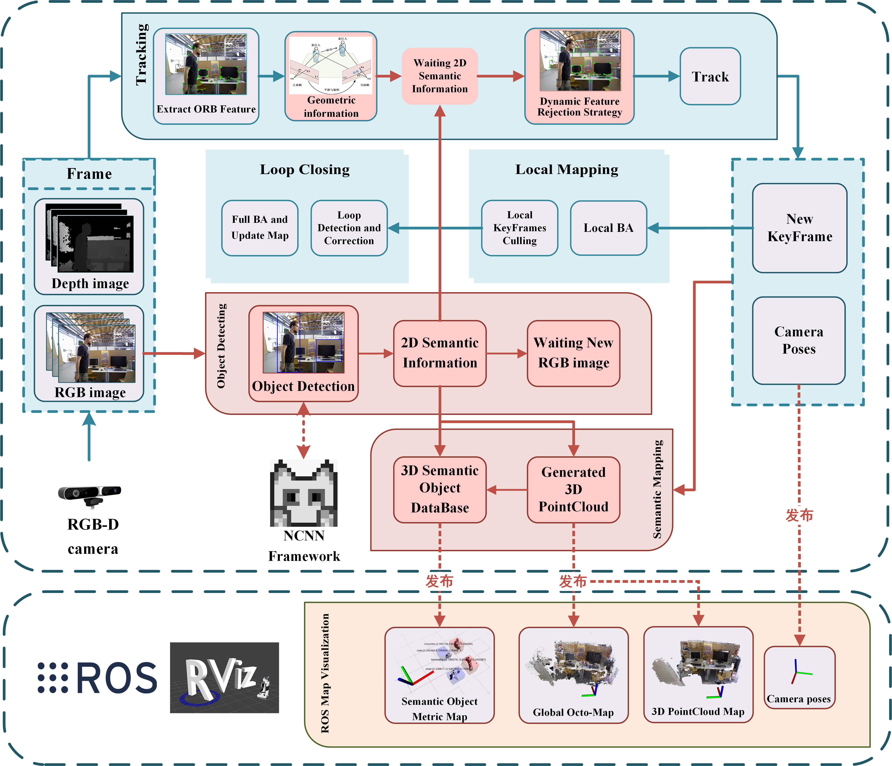

# SG-SLAM

Simultaneous Localization and Mapping (SLAM) is one of the fundamental capabilities for intelligent mobile robots to perform state estimation in unknown environments. However, most visual SLAM systems **rely on the static scene assumption** and consequently have severely reduced accuracy and robustness in dynamic scenes. Moreover, the metric maps constructed by many systems **lack semantic information**, so the robots cannot understand their surroundings at a human cognitive level. 

In this paper, we propose SG-SLAM, which is a real-time RGB-D semantic visual SLAM system based on the [ORB-SLAM2](https://github.com/raulmur/ORB_SLAM2) framework. First, SG-SLAM adds two new parallel threads: an object detecting thread to obtain 2D semantic information and a semantic mapping thread. Then, a **fast dynamic feature rejection algorithm combining semantic and geometric information** is added to the tracking thread. Finally, they are published to the ROS system for visualization after generating 3D point clouds and 3D semantic objects in the **semantic mapping thread**. 

We performed an experimental evaluation on the TUM dataset, the Bonn dataset, and the OpenLORIS-Scene dataset. The results show that SG-SLAM is not only one of the most real-time, accurate, and robust systems in dynamic scenes, but also allows the creation of intuitive semantic metric maps.



**Figure1**. Overview of the framework of the SG-SLAM system. The original work of ORB-SLAM2 is presented on an aqua-green background, while **our main new or modified work is presented on a red background**.

**System Features :**

- Based on ORB-SLAM2, NCNN,  ROS, etc.
- Fast running  (if NCNN is well configured)
- Easy to deploy
- ...

## 1. License

SG-SLAM is released under a [GPLv3 license](https://github.com/silencht/SG-SLAM/blob/main/LICENSE).

Paper is available under the "Early Access" area on [IEEE Xplore](https://ieeexplore.ieee.org/document/9978699).

If you use SG-SLAM in an academic work, please cite:

```
S. Cheng, C. Sun, S. Zhang and D. Zhang, "SG-SLAM: A Real-Time RGB-D Visual SLAM toward Dynamic Scenes with Semantic and Geometric Information," in IEEE Transactions on Instrumentation and Measurement, doi: 10.1109/TIM.2022.3228006.
```

## 2. Building SG-SLAM

```bash
#Basic
sudo apt-get update
sudo apt install git
sudo apt install cmake
sudo apt install build-essential
sudo apt vim
#test
git --version
gcc --version
g++ --version
cmake --version

#Pangolin
sudo apt install libglew-dev
sudo apt install libboost-dev libboost-thread-dev libboost-filesystem-dev
sudo apt install libpython2.7-dev
git clone https://github.com/stevenlovegrove/Pangolin.git
cd Pangolin/
git checkout v0.5
mkdir build
cd build
cmake ..
make -j4
sudo make install

#OpenCV,refer https://docs.opencv.org/3.4.15/d7/d9f/tutorial_linux_install.html
sudo apt install libgtk2.0-dev pkg-config libavcodec-dev libavformat-dev libswscale-dev
sudo apt install python-dev python-numpy libtbb2 libtbb-dev libjpeg-dev libpng-dev libtiff-dev libjasper-dev libdc1394-22-dev
git clone https://github.com/opencv/opencv.git
cd opencv/
git checkout 3.4.15
mkdir build
cd build
cmake -D CMAKE_BUILD_TYPE=Release -D CMAKE_INSTALL_PREFIX=/usr/local ..
sudo make install
#test
pkg-config opencv --modversion

#Eigen
git clone https://gitlab.com/libeigen/eigen.git
cd eigen/
git checkout 3.1.0
mkdir build
cd build
cmake ..
sudo make install
#test
cat /usr/local/include/eigen3/Eigen/src/Core/util/Macros.h
#Compile orb-slam2 with build.sh,and now orbslam2 can perform well

#ROS
#For china,first,replace our resource(http://wiki.ros.org/ROS/Installation/UbuntuMirrors)
sudo sh -c '. /etc/lsb-release && echo "deb http://mirrors.tuna.tsinghua.edu.cn/ros/ubuntu/ `lsb_release -cs` main" > /etc/apt/sources.list.d/ros-latest.list'
#Set up keys
sudo apt-key adv --keyserver 'hkp://keyserver.ubuntu.com:80' --recv-key C1CF6E31E6BADE8868B172B4F42ED6FBAB17C654
sudo apt update
#this ros below is for ubuntu 18.04
sudo apt install ros-melodic-desktop-full
#Environment setup
echo "source /opt/ros/melodic/setup.bash" >> ~/.bashrc
source ~/.bashrc
#Dependencies for building packages
sudo apt install python-rosinstall python-rosinstall-generator python-wstool build-essential
#Initialize rosdep.If you encounter problems, refer to this article,https://zhuanlan.zhihu.com/p/397966333
sudo apt install python-rosdep
sudo rosdep init
rosdep update
#test
roscore

#PCL,and pcl-tools(optional)
sudo apt install libpcl-dev pcl-tools

#Octomap,and octovis(optional)
sudo apt install liboctomap-dev octovis
sudo apt install ros-melodic-octomap ros-melodic-octomap-mapping ros-melodic-octomap-msgs ros-melodic-octomap-ros ros-melodic-octomap-rviz-plugins 

#SG-SLAM
git clone https://github.com/silencht/SG-SLAM

#Build Thirdparty Liarbry
cd SG-SLAM/src/sg-slam/
./ThirdpartyBuild.sh
#How to build ncnn completely? Please refer HowTo in https://github.com/Tencent/ncnn/README.md
#After installing the nvidia driver,vulkan and etc., compile ncnn and install
#-DNCNN_DISABLE_RTTI=OFF (https://github.com/Tencent/ncnn/issues/2665)
cd SG-SLAM/src/sg-slam/Thirdparty/ncnn/
mkdir build
cd build
cmake -DCMAKE_TOOLCHAIN_FILE=../toolchains/host.gcc.toolchain.cmake -DNCNN_DISABLE_RTTI=OFF ..
make -j4
sudo make install

#Modify the path in SG-SLAM/src/sg-slam/CMakeLists.txt
#set(ncnn_DIR "there,replace with your path/SG-SLAM/src/sg-slam/Thirdparty/ncnn/build/install/lib/cmake/ncnn" CACHE PATH "Directory that contains ncnnConfig.cmake")

#Init ROS workspace and compile package
cd SG-SLAM/src
catkin_init_workspace
cd ..
catkin_make --pkg cv_bridge
catkin_make --pkg image_geometry
catkin_make --pkg octomap_server
catkin_make --pkg sg-slam
```

## 3. Running SG-SLAM

Put the [TUM dataset](https://vision.in.tum.de/data/datasets/rgbd-dataset/download) into the *Music Path* according to the **run_tum_walking_xyz.sh** file (or adjust the script yourself)

```bash
#Runing SG-SLAM
#terminal 1
roscore
#terminal 2
cd SG-SLAM/src/octomap_server/launch
roslaunch octomap.launch
#terminal 3
roslaunch transform.launch
#terminal 4
rviz
#terminal 5
cd SG-SLAM/src/sg-slam/
./run_tum_walking_xyz.sh
```

## 4. Reference Project

**Including but not limited to the following repositories  (In no particular order) : **

- https://github.com/raulmur/ORB_SLAM2
- https://github.com/ivipsourcecode/DS-SLAM
- https://github.com/Ewenwan/ORB_SLAM2_SSD_Semantic
- https://github.com/MRwangmaomao/semantic_slam_nav_ros
- https://github.com/gaoxiang12/ORBSLAM2_with_pointcloud_map
- https://github.com/abhineet123/ORB_SLAM2
- https://github.com/floatlazer/semantic_slam
- https://github.com/bijustin/YOLO-DynaSLAM
- https://github.com/bijustin/Fast-Dynamic-ORB-SLAM
- https://github.com/halajun/VDO_SLAM
- https://github.com/Quitino/IndoorMapping
- ...

## 5. PostScript

- To be supplemented...
